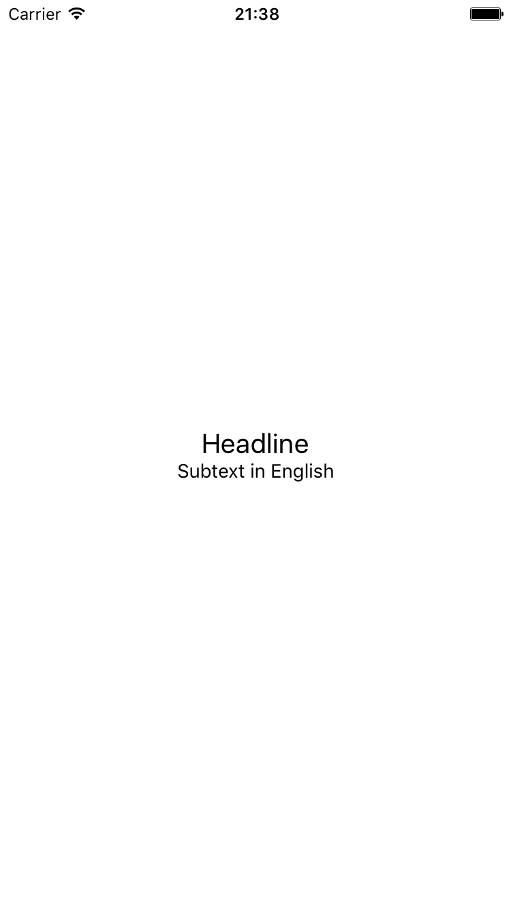
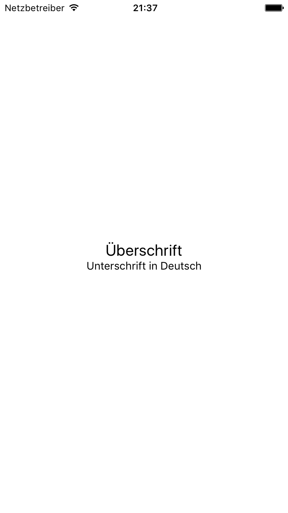

# ReactNativeLocalization transifex example

Example to illustrate how to use with transifex.

## What it does

This is a sample app that only contains two strings in centered in a view.

Translations are done for German, all other languages fall back to English.

Translations can be pushed and pulled using the transifex commandline client.

## Transifex link
The translation can be found here: https://www.transifex.com/gri/reactnativelocalizationtransifex

## Obligatory screenshots

